

    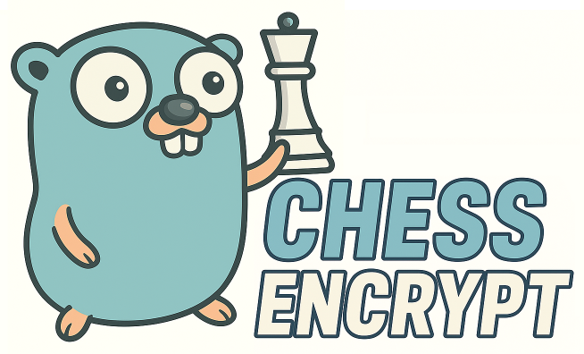
   
  <i>Hide your files in chess games, and upload them anywhere!</i>

# About

**chessencrypt** is a [steganographic](https://en.wikipedia.org/wiki/Steganography) tool that encodes files into valid <a href="https://en.wikipedia.org/wiki/Portable_Game_Notation">PGN</a> chess game files, hiding data within a chess game using predefined moves to represent binary information. While it is not a compression or encryption method, it obfuscates the file by transforming it into a seemingly innocent chess game format so you can upload it to your favorite chess website.

# Quick Start

I might create a GUI for this in the future, but for now only a cmd version is available.

1. `git clone https://github.com/nedlir/chessencrypt.git`
2. `cd chessencrypt`
3. To encode file into a PGN: `go run ./cmd/cli/main.go encode {input_filepath} {output_filepath}`
4. To decode file from PGNs: `go run ./cmd/cli/main.go decode {input_filepath} {output_filepath}`

# The Algorithm

To convert the input file into PGN format, we introduce "The Dancing Queens" algorithm <a href="https://www.youtube.com/watch?v=xFrGuyw1V8s">(yep, just like that 🔥 song by ABBA)</a>.

We start by breaking our files into byte chunks. Since each byte is made up of 8 bits, we can represent that on the chessboard's rows 6 to 1.

## What this is not

- This algorithm does not find the shortest path of all the bits, as we care to encode the files fast, and not to find the fastest route between bits.

- This algorithm does not build an interesting chess game. It's boring, but efficient.

- This is not a compression algorithm. The primary aim is to hide files within PGN chess games, not to reduce the file size.

- This is not a cryptographic hash function. The algorithm does not perform hashing or produce unique identifiers for files based on their content. Instead, it embeds the file's data in a chess game using a set pattern of movements.

## Board setup

The algorithm begins from a pre-set position that’s convenient for our needs. Starting from the opening position would require many moves to reach the desired setup, which can be costly. Since this is a logical position, we use it directly - while still maintaining a valid board (the king must be present) and legal moves (queens can only move to reachable squares).

The chessboard is divided into two logical zones, each ruled by its own queen. These queens stay in their respective zones and never cross into each other’s territory during runtime (we use 2 separate matrixes to represent each zone).

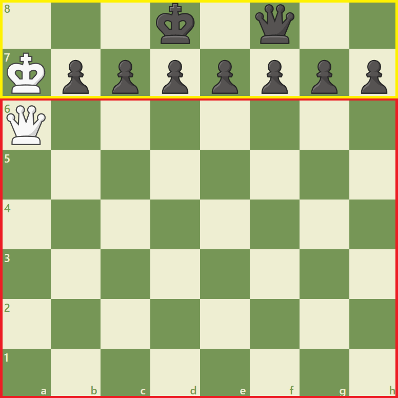

### Determining first bit's value

The kings in this setup are passive - they remain stationary throughout the entire game. Their role is both symbolic and structural: they ensure the board is valid (a legal chess game must include both kings), and the white king's starting position also determines whether the first bit of the matrix is set to 1 or not.

The only difference we may have between boards is the whether the location of white king is on square a7 or square a8. This will be determined by the <a href="https://en.wikipedia.org/wiki/Forsyth%E2%80%93Edwards_Notation">FEN</a> code we pre-set.

  <table width="80%" cellspacing="5" cellpadding="5" style="border-collapse: separate;">
    <tr>
      <td align="center" style="width:50%; border: 1px solid #ccc; border-radius: 8px; padding: 10px;">
        
<strong>First bit is 0 (king on a7)</strong>

        

          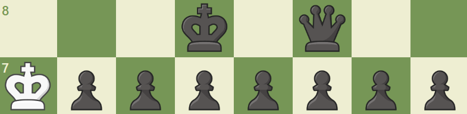
        

        
<code>3k1q2/Kppppppp/Q7/8/8/8/8/8 b - - 0 1</code>

      </td>
      <td align="center" style="width:50%; border: 1px solid #ccc; border-radius: 8px; padding: 10px;">
        
<strong>First bit is 1 (king on a8)</strong>

        

          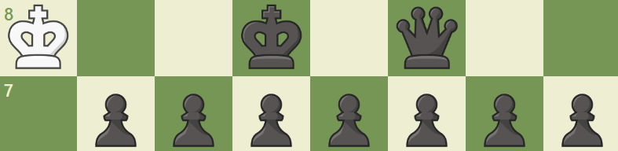
        

        
<code>K2k1q2/1ppppppp/Q7/8/8/8/8/8 b - - 0 1</code>

      </td>
    </tr>
  </table>

## Game

### White Queen's Movement

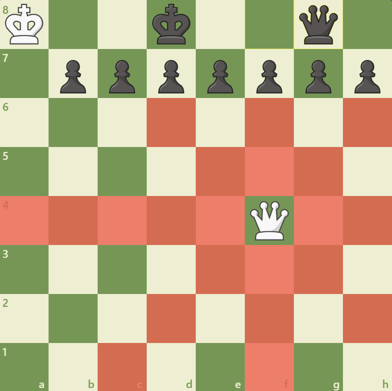

#### <u>Definition:</u> A Queen in chess can move from its current square to any target square on the board if and only if the <a href="https://en.wikipedia.org/wiki/Taxicab_geometry">Manhattan distance</a> between the two squares is non-zero and the path is not blocked by any piece.

Or in simpler words, the queen can move any number of squares along a rank, file, or diagonal, provided no other pieces obstruct the route.

Let our custom chessboard be an $8 \times 6$ grid with coordinates $(\text{col}, \text{row})$, where:

$$
\text{col} \in \{a, b, c, d, e, f, g, h\}, \quad \text{row} \in \{1, \ldots, 6\}.
$$

A **queen** positioned at square $Q = (\text{col}_q, \text{row}_q)$ can move to a target square $T = (\text{col}_t, \text{row}_t)$ if and only if the following conditions hold:

**Move direction condition:** The move is along a rank, file, or diagonal, i.e.,

$$
|\text{col}_q - \text{col}_t| = 0 \quad \text{or} \quad |\text{row}_q - \text{row}_t| = 0 \quad \text{or} \quad |\text{col}_q - \text{col}_t| = |\text{row}_q - \text{row}_t|.
$$

**Non-zero move condition:** The Manhattan distance between $Q$ and $T$ is greater than zero. The queen must actually move to a different square (can not stay in place according to rules of chess):

$$
d_{\text{Manhattan}}(Q, T) = |\text{col}_q - \text{col}_t| + |\text{row}_q - \text{row}_t| > 0.
$$

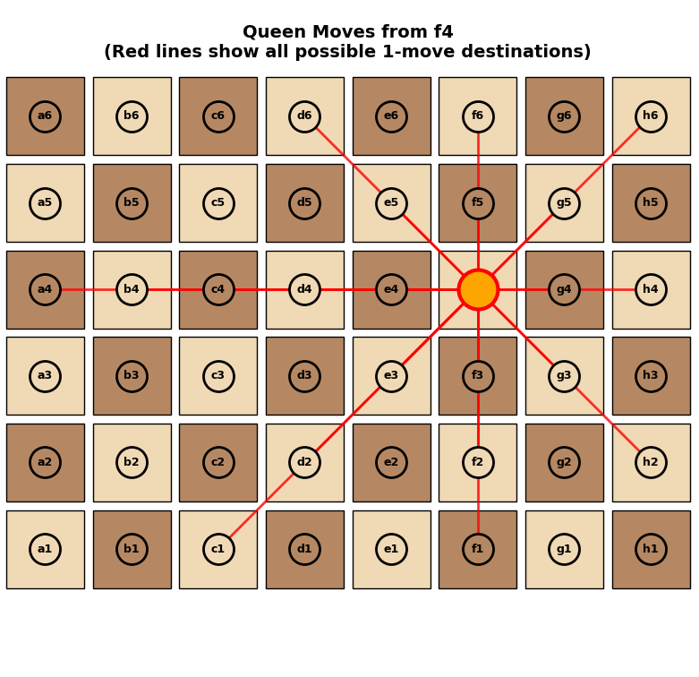

### Reachability in at most two moves with one assistance move

If the queen cannot reach $T$ in one move, an **assistance move** (not counted as a move) can be made to reposition the queen to an intermediate square $M$ that enables reaching $T$ in one subsequent move. This assistance move is a free repositioning along a rank, file, or diagonal without obstruction.

On this $8 \times 6$ board, **a queen can reach any square $T$ from any starting square $Q$ in at most two moves**, since there are no pieces blocking her path.

If the queen **cannot reach $T$ in one move**, then there exists an intermediate square $M = (x_m, y_m)$ such that:

1.  The queen can move from $Q$ to $M$ in one move (along rank, file, or diagonal),
2.  Then from $M$ to $T$ in another move (along rank, file, or diagonal).

Formally, there exists $M$ satisfying:

$$
\begin{cases}
|x_q - x_m| = 0 \quad \text{or} \quad |y_q - y_m| = 0 \quad \text{or} \quad |x_q - x_m| = |y_q - y_m|, \\
d_{\text{Manhattan}}(Q, M) > 0,
\end{cases}
$$

and

$$
\begin{cases}
|x_m - x_t| = 0 \quad \text{or} \quad |y_m - y_t| = 0 \quad \text{or} \quad |x_m - x_t| = |y_m - y_t|, \\
d_{\text{Manhattan}}(M, T) > 0.
\end{cases}
$$

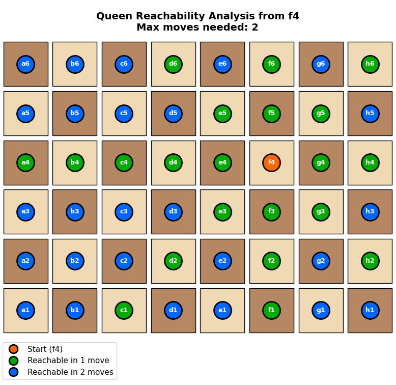

---

### Black Queen's Movement

#### <u>Definition:</u> The Black Queen functions as a signaling mechanism, indicating whether the White Queen's next move will result in setting a bit to 1. This signal is encoded by the number of squares the Black Queen traverses in a straight-line movement along the board's $f$ row.

- If the Black Queen jumps **exactly one square**, it means the White Queen’s next move will set the bit to 1.
- If the Black Queen jumps **two or more squares**, it means the White Queen’s next move will leave the bit as 0 (no change).

Formally, if the Black Queen moves from position \( B = (x_b, y_b) \) to position \( T = (x_t, y_t) \), the bit \( b \) it encodes is:

$$
b =
\begin{cases}
1 & \text{if the Manhattan distance } d_{\text{Manhattan}}(B, T) = 1, \\
0 & \text{if } d_{\text{Manhattan}}(B, T) \geq 2,
\end{cases}
$$

where the Manhattan distance is:

$$
d_{\text{Manhattan}}(B, T) = |x_b - x_t| + |y_b - y_t|.
$$

  <table cellspacing="5" cellpadding="5" style="border-collapse: separate;">
    <tr>
      <td align="center" style="width:50%; border: 1px solid #ccc; border-radius: 8px;;">
        
<strong>Set Bit (1)</strong>

        

          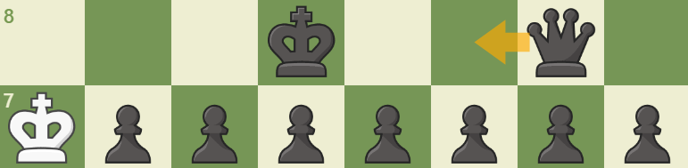
        

        
Jump one square if White's next move is intended to set the bit to 1.

      </td>
      <td align="center" style=" border: 1px solid #ccc; border-radius: 8px;">
        
<strong>Skip Bit (0) - Assistance Move</strong>

        

          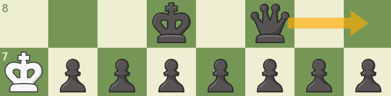
        

        
Jump multiple squares ahead if White's next move is meant to leave the bit unchanged .

      </td>
    </tr>
  </table>

## Complexity

Traversing an entire ($N \times M$) bit matrix (where $N$ is the number of rows and $M$ is the number of columns) using a nested for loop scan has a time complexity of $O(N \times M)$.

Since we are working with bits, we can optimize this using the [find first set (ffs)](https://en.wikipedia.org/wiki/Find_first_set) operation. Xommonly implemented using a "count trailing zeros" instruction, which allows us to locate the first set bit (1) in a machine word in constant time, so thatt:

$$
\text{ffs}(x) = O(1)
$$

Using this, the algorithm improves to a complexity of:

$$
O(N \times B)
$$

where $B$ is the number of bits per row. In practical terms, we process each row word by skipping over zero-only words and stopping early when a 1 is found.

In the worst-case scenario however, where every bit in the matrix is set to 1, the optimization provides no benefit, and the time complexity falls back to:

$$
O(N \times M)
$$

Although this is theoretically possible, such dense matrices are uncommon, so the optimized approach usually will outperform significantly better in practice.

## Multithreading

When the queen reaches the last set bit on row a (the bottom row), we create a PGN file with the moves so far and proceed on to create another file.

Finally, the algorithm creates multiple files where each file is representing 6 bytes. Instead of creating a new file every time we finish traversing the matrix, we could have created a single PGN game containing the whole file we want to ecnrypt, and reset the queens position $T$ to be at the start of the board $(0, 0)$ for white Queen (square a6) and for black queen (f8), as established previously, we can do it for at least 1 move and no more than 2 moves, or formally:

$$ 1 <= d\_{\text{Manhattan}}(Q, M) <= 2$$

This will be much quicker and much less overhead than creating a new file each time.

I decided to leave the current process with multiple files to leave an open door for future parallel implementation with go routines. This makes the algorithm more robust and ready to handle situations like file corruptions or handling of huge files.

## Demo

Let's view how a [game](https://lichess.org/phqh1hEM#65) of a file containing the word `Golang` would be played.

Here are the values of the letters `Golang` is built from:

    <table>
        <thead>
            <tr>
                <th>Character</th>
                <th>Binary</th>
            </tr>
        </thead>
        <tbody>
            <tr>
                <td><code>G</code></td>
                <td>01000111</td>
            </tr>
            <tr>
                <td><code>o</code></td>
                <td>01101111</td>
            </tr>
            <tr>
                <td><code>l</code></td>
                <td>01101100</td>
            </tr>
            <tr>
                <td><code>a</code></td>
                <td>01100001</td>
            </tr>
            <tr>
                <td><code>n</code></td>
                <td>01101110</td>
            </tr>
            <tr>
                <td><code>g</code></td>
                <td>01100111</td>
            </tr>
        </tbody>
    </table>

So these are the swuares we will have to mark:

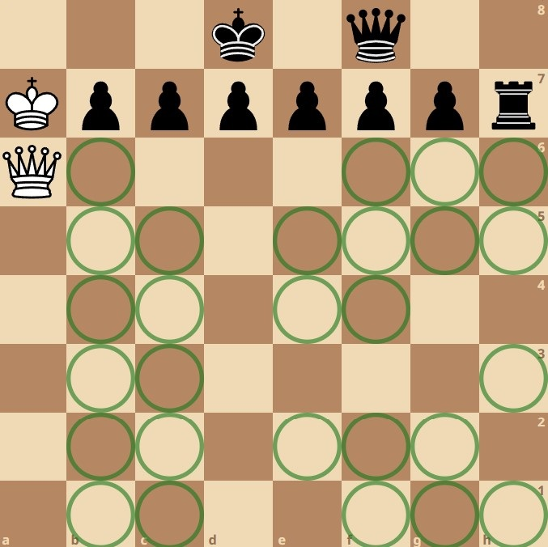

And the whole gameplay:

 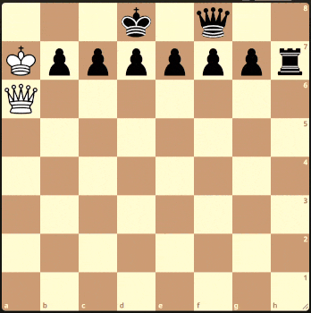
